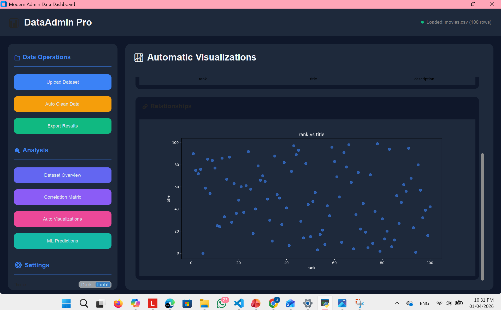
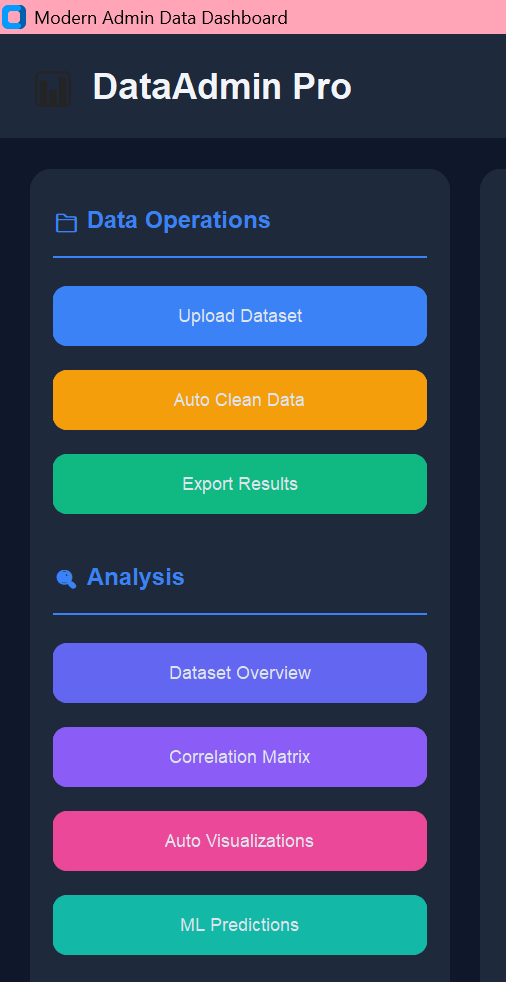
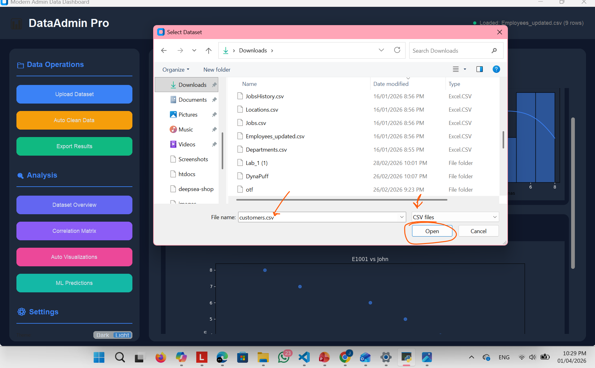

```markdown
# DataForge - Modern Admin Data Dashboard


**Upload any dataset → Get instant insights → Auto-generate visualizations → Run ML models**



## ✨ Features



- 📁 **Multi-Format Support**: CSV, Excel (.xlsx/.xls), JSON
- 🧹 **Smart Auto-Clean**: Handles missing values, duplicates, encodes categoricals
- 📊 **Auto-Visualization**: Generates distributions, correlations, scatter plots automatically
- 🤖 **ML Engine**: Auto-detects regression/classification, Random Forest models
- 🎨 **Modern UI**: Dark theme, card-based layout, responsive design
- 💾 **Export**: Save cleaned data as CSV or Excel

## 🚀 Quick Start

### Installation
```bash
# Clone the repo
git clone https://github.com/yourusername/DataForge.git
cd DataForge

# Install dependencies
pip install -r requirements.txt
```

### Run
```bash
python dashboard.py
```

## 📋 Requirements

- pandas >= 1.3.0
- numpy >= 1.21.0
- seaborn >= 0.11.0
- matplotlib >= 3.4.0
- customtkinter >= 5.0.0
- scikit-learn >= 1.0.0
- openpyxl >= 3.0.0

## 🖼️ Screenshots

| Upload Dataset | Dashboard Preview |
|:--:|:--:|
|  |  |

## 🛠️ How to Use

1. **Upload** your dataset (CSV/Excel/JSON)
2. **Auto Clean** - fixes missing values & encodes data automatically
3. **Explore**:
   - 📊 **Overview**: Dataset stats + preview
   - 🔥 **Correlation**: Interactive heatmap
   - 📈 **Visualizations**: Auto-generated charts
   - ⚙️ **ML Analysis**: Select target column, run predictions

## 🧠 ML Capabilities

| Feature | Description |
|---------|-------------|
| Auto-Detection | Automatically detects regression vs classification |
| Random Forest | Uses RF instead of basic linear models |
| Feature Importance | Visualizes top 10 important features |
| Metrics | R², MSE, RMSE, Accuracy |

## 🎨 Customization

```python
# Change theme
ctk.set_appearance_mode("light")  # or "dark"

# Modify colors
colors = {
    'primary': "#3B82F6",   # Blue
    'success': "#10B981",   # Green
    'warning': "#F59E0B",   # Orange
    'danger': "#EF4444",    # Red
}
```

## 🤝 Contributing

1. Fork the repository
2. Create your feature branch (`git checkout -b feature/AmazingFeature`)
3. Commit your changes (`git commit -m 'Add some AmazingFeature'`)
4. Push to the branch (`git push origin feature/AmazingFeature`)
5. Open a Pull Request

## 📝 License

Distributed under the MIT License. See `LICENSE` for more information.

## 🙏 Acknowledgments

- [CustomTkinter](https://github.com/TomSchimansky/CustomTkinter) - Modern tkinter widgets
- [Seaborn](https://seaborn.pydata.org/) - Statistical visualizations
- [Scikit-learn](https://scikit-learn.org/) - Machine learning

---

Made with ❤️ by [Jomana](https://github.com/jomanamostafa/DataForge)
```
